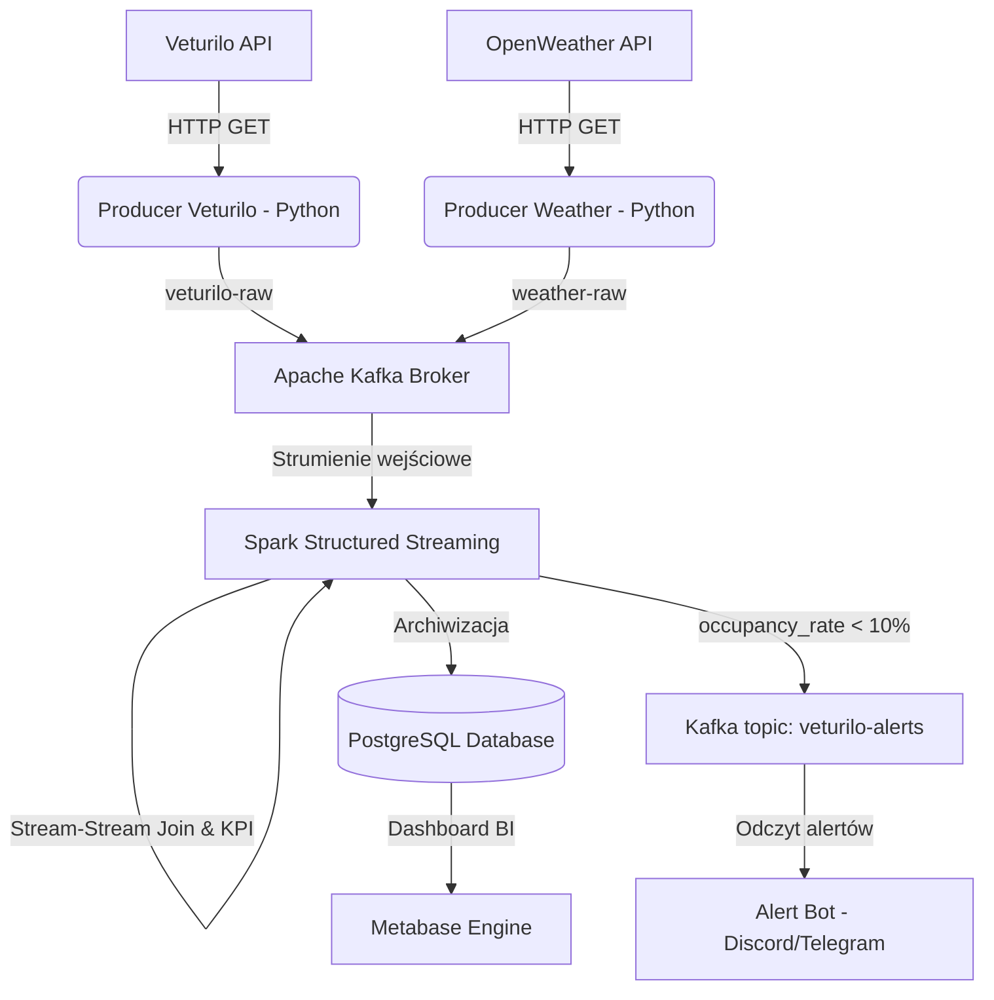

# 🚲 Veturilo Real-Time Urban Mobility Monitor

System w czasie rzeczywistym do monitorowania dostępności floty rowerów miejskich **Nextbike Veturilo** w Warszawie oraz łączenia tych danych z warunkami pogodowymi (**OpenWeatherMap API**). System potrafi wyliczać KPI (wskaźnik zapełnienia stacji), archiwizować dane analityczne w PostgreSQL oraz wyzwalać alerty o krytycznym braku rowerów (< 10% zapełnienia) i publikować je z powrotem do brokerów i komunikatorów (Discord / Telegram).

---

## 🏗️ Architektura Systemowa (DevOps View)

Projekt działa w pełni w zintegrowanym środowisku kontenerowym z wirtualną siecią bridge (`veturilo-network`). 



### Usługi w `docker-compose.yml`:
1. **Apache Kafka (KRaft Mode)** (`localhost:9092` dla hosta, `kafka:29092` wewnątrz sieci Docker): Broker wiadomości czasu rzeczywistego.
2. **PostgreSQL 15** (`localhost:5432` dla hosta, `postgres:5432` w sieci Docker): Trwała baza danych.
3. **Metabase BI** (`http://localhost:3000`): Narzędzie analityczne do wizualizacji na żywo.

---

## 📦 Funkcje wdrożone przez DevOps / Infra Engineer
* **Persystencja Danych (Volumes)**: Skonfigurowano osobne, trwałe wolumeny (`postgres_data`, `kafka_data`, `metabase_data`) chroniące przed utratą danych po restarcie kontenerów.
* **Auto-Inicjalizacja Bazy (Entrypoint init)**: Skrypt SQL `postgres-init/init.sql` montowany jest bezpośrednio w kontenerze Postgresa, automatycznie tworząc tabele `station_status` i `veturilo_alerts` oraz optymalne indeksy przy pierwszym uruchomieniu.
* **Kontrola Kolejności Startu (Healthchecks)**: Zdefiniowano zaawansowane testy żywotności serwisów. Metabase nie uruchomi się, dopóki baza danych i Kafka nie zgłoszą pełnej gotowości.
* **Elastyczność Sieciowa**: Skrypty Python posiadają dynamiczną konfigurację zmiennych środowiskowych, dzięki czemu mogą bez zmian kodu działać zarówno lokalnie na hoście (`localhost`), jak i wewnątrz kontenerów.

---

## 🚀 Instrukcja Uruchomienia Projektu

### Wymagania wstępne:
1. Zainstalowany i uruchomiony **Docker Desktop**.
2. Zainstalowany **Python 3.8+** lokalnie.

### Krok 1: Przygotowanie środowiska Python (venv)
Otwórz terminal w głównym folderze projektu `veturillo-real-time-analysis` i wykonaj:

```bash
# Tworzenie wirtualnego środowiska
python3 -m venv venv

# Aktywacja (macOS / Linux)
source venv/bin/activate

# Aktywacja (Windows PowerShell)
# Set-ExecutionPolicy -ExecutionPolicy RemoteSigned -Scope Process
# .\venv\Scripts\Activate.ps1

# Instalacja zależności
pip install -r requirements.txt
```

### Krok 2: Uruchomienie infrastruktury Docker
Uruchom kontenery w tle:

```bash
# macOS / Linux (skrypt automatyczny)
chmod +x start_all.sh
./start_all.sh

# Lub bezpośrednio komendą:
docker compose up -d
```

Zweryfikuj stan kontenerów za pomocą `docker ps`. Powinieneś zobaczyć 3 kontenery ze statusem `Up (healthy)`.

---

## 🛠️ Uruchamianie i Testowanie Potoku Danych (Krok po Kroku)

Aby zobaczyć pełne działanie systemu, otwórz 4 osobne okna terminala (z aktywowanym `venv`):

### Terminal 1: Uruchomienie Producentów Danych
Skrypty zaczną pobierać dane na żywo i wysyłać je do Kafki:
```bash
# Producent Veturilo (odczyt co 60 sekund)
python producers/producer_veturilo.py

# Producent Pogody (odczyt co 5 minut)
python producers/producer_weather.py
```

### Terminal 2: Uruchomienie Procesu Spark (Structured Streaming)
Spark pobierze pakiety, połączy strumienie stacji i pogody w oknie czasowym, obliczy zapełnienie i zapisze dane do PostgreSQL:
```bash
python stream_processing/spark_app.py
```
*Uwaga: Przy pierwszym starcie Spark automatycznie pobierze z internetu wymagane biblioteki łącznika Kafka i Postgres (może to zająć chwilę).*

### Terminal 3: Uruchomienie Alert Bota
Bot zacznie nasłuchiwać komunikatów na Kafce o stacjach mających poniżej 10% zapełnienia:
```bash
python alerts/alert_bot.py
```
*Tip: Możesz ustawić zmienną środowiskową `DISCORD_WEBHOOK_URL` w systemie przed startem, aby bot wysyłał alerty graficzne prosto na Twój serwer Discord!*

### Terminal 4: Wizualizacja w Metabase
1. Wejdź na `http://localhost:3000` w przeglądarce.
2. Skonfiguruj konto admina (możesz pominąć kroki początkowe lub dodać bazę danych).
3. Dodaj nową bazę danych typu **PostgreSQL**:
   - **Host**: `postgres` (nazwa serwisu z sieci Docker!)
   - **Port**: `5432`
   - **Database name**: `veturilo_db`
   - **Database username**: `veturilo_user`
   - **Database password**: `veturilo_password`
4. Ciesz się danymi analitycznymi w czasie rzeczywistym! Tabele `station_status` i `veturilo_alerts` będą regularnie odświeżane.

---

## 📊 Schemat Tabel Bazodanowych

### Tabela `station_status` (Historia stanów i KPI)
| Kolumna | Typ | Opis |
| :--- | :--- | :--- |
| `station_id` | INT | Unikalne ID stacji Veturilo |
| `name` | VARCHAR | Nazwa stacji (np. "Koneser") |
| `bikes_available` | INT | Liczba aktualnie dostępnych rowerów |
| `bike_racks` | INT | Liczba stojaków ogółem |
| `free_racks` | INT | Liczba wolnych stojaków |
| `occupancy_rate` | DOUBLE | **KPI**: Zapełnienie stacji w % |
| `temp` | DOUBLE | Aktualna temperatura w Warszawie (°C) |
| `rain` | DOUBLE | Opad deszczu z ostatniej godziny (mm) |
| `event_time` | TIMESTAMP | Dokładny czas zdarzenia ze stacji (UTC) |

### Tabela `veturilo_alerts` (Logi alertów krytycznych)
Zapisuje stacje o krytycznie niskim stanie floty (`occupancy_rate < 10%`) wraz z panującą pogodą w celach analizy korelacji.
