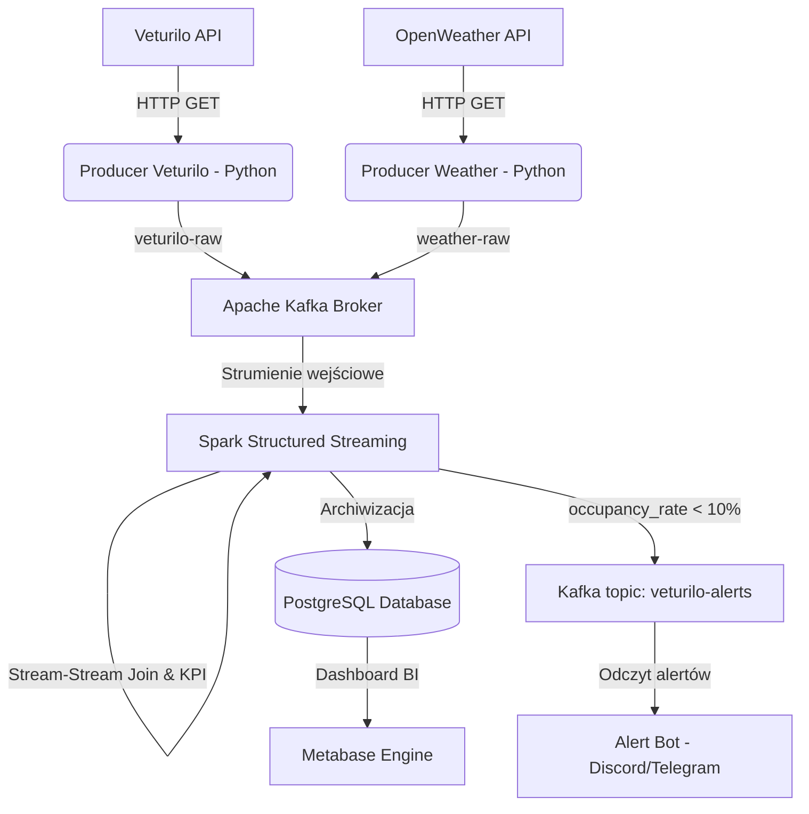

# 🚲 Veturilo Real-Time Urban Mobility Monitor

System w czasie rzeczywistym do monitorowania dostępności floty rowerów miejskich **Nextbike Veturilo** w Warszawie oraz łączenia tych danych z warunkami pogodowymi (**OpenWeatherMap API**). System potrafi wyliczać KPI (wskaźnik zapełnienia stacji), archiwizować dane analityczne w PostgreSQL oraz wyzwalać alerty o krytycznym braku rowerów (< 10% zapełnienia) i publikować je z powrotem do brokerów i komunikatorów (Discord / Telegram).

---

## 🏗️ Architektura Systemowa (DevOps View)

Projekt działa w pełni w zintegrowanym środowisku kontenerowym z wirtualną siecią bridge (`veturilo-network`). 



### Usługi w `docker-compose.yml`:
1. **Apache Kafka (KRaft Mode)** (`localhost:9092` dla hosta, `kafka:29092` wewnątrz sieci Docker): Broker wiadomości czasu rzeczywistego.
2. **PostgreSQL 15** (`localhost:5432` dla hosta, `postgres:5432` w sieci Docker): Trwała baza danych.
3. **Metabase BI** (`http://localhost:3000`): Narzędzie analityczne do wizualizacji na żywo.

---

## 📦 Funkcje wdrożone przez DevOps / Infra Engineer
* **Persystencja Danych (Volumes)**: Skonfigurowano osobne, trwałe wolumeny (`postgres_data`, `kafka_data`, `metabase_data`) chroniące przed utratą danych po restarcie kontenerów.
* **Auto-Inicjalizacja Bazy (Entrypoint init)**: Skrypt SQL `postgres-init/init.sql` montowany jest bezpośrednio w kontenerze Postgresa, automatycznie tworząc tabele `station_status` i `veturilo_alerts` oraz optymalne indeksy przy pierwszym uruchomieniu.
* **Kontrola Kolejności Startu (Healthchecks)**: Zdefiniowano zaawansowane testy żywotności serwisów. Metabase nie uruchomi się, dopóki baza danych i Kafka nie zgłoszą pełnej gotowości.
* **Elastyczność Sieciowa**: Skrypty Python posiadają dynamiczną konfigurację zmiennych środowiskowych, dzięki czemu mogą bez zmian kodu działać zarówno lokalnie na hoście (`localhost`), jak i wewnątrz kontenerów.

---

## 🚀 Instrukcja Uruchomienia Projektu

### Wymagania wstępne:
1. Zainstalowany i uruchomiony **Docker Desktop**.
2. Zainstalowany **Python 3.8+** lokalnie.

### Krok 1: Przygotowanie środowiska Python (venv)
Otwórz terminal w głównym folderze projektu `veturillo-real-time-analysis` i wykonaj:

```bash
# Tworzenie wirtualnego środowiska
python3 -m venv venv

# Aktywacja (macOS / Linux)
source venv/bin/activate

# Aktywacja (Windows PowerShell)
# Set-ExecutionPolicy -ExecutionPolicy RemoteSigned -Scope Process
# .\venv\Scripts\Activate.ps1

# Instalacja zależności
pip install -r requirements.txt
```

### Krok 2: Uruchomienie infrastruktury Docker
Uruchom kontenery w tle:

```bash
# macOS / Linux (skrypt automatyczny)
chmod +x start_all.sh
./start_all.sh

# Lub bezpośrednio komendą:
docker compose up -d
```

Zweryfikuj stan kontenerów za pomocą `docker ps`. Powinieneś zobaczyć 3 kontenery ze statusem `Up (healthy)`.

---

## 🛠️ Uruchamianie i Testowanie Potoku Danych (Krok po Kroku)

Aby zobaczyć pełne działanie systemu, otwórz 4 osobne okna terminala (z aktywowanym `venv`):

### Terminal 1: Uruchomienie Producentów Danych
Skrypty zaczną pobierać dane na żywo i wysyłać je do Kafki:
```bash
# Producent Veturilo (odczyt co 60 sekund)
python producers/producer_veturilo.py

# Producent Pogody (odczyt co 5 minut)
python producers/producer_weather.py
```

### Terminal 2: Uruchomienie Procesu Spark (Structured Streaming)
Spark pobierze pakiety, połączy strumienie stacji i pogody w oknie czasowym, obliczy zapełnienie i zapisze dane do PostgreSQL:
```bash
python stream_processing/spark_app.py
```
*Uwaga: Przy pierwszym starcie Spark automatycznie pobierze z internetu wymagane biblioteki łącznika Kafka i Postgres (może to zająć chwilę).*

### Terminal 3: Uruchomienie Alert Bota
Bot zacznie nasłuchiwać komunikatów na Kafce o stacjach mających poniżej 10% zapełnienia:
```bash
python alerts/alert_bot.py
```
*Tip: Możesz ustawić zmienną środowiskową `DISCORD_WEBHOOK_URL` w systemie przed startem, aby bot wysyłał alerty graficzne prosto na Twój serwer Discord!*

### Terminal 4: Wizualizacja w Metabase
1. Wejdź na `http://localhost:3000` w przeglądarce.
2. Skonfiguruj konto admina (możesz pominąć kroki początkowe lub dodać bazę danych).
3. Dodaj nową bazę danych typu **PostgreSQL**:
   - **Host**: `postgres` (nazwa serwisu z sieci Docker!)
   - **Port**: `5432`
   - **Database name**: `veturilo_db`
   - **Database username**: `veturilo_user`
   - **Database password**: `veturilo_password`
4. Ciesz się danymi analitycznymi w czasie rzeczywistym! Tabele `station_status` i `veturilo_alerts` będą regularnie odświeżane.

---

## ⚙️ Architektura joinu strumieni w `spark_app.py`

Spark Structured Streaming narzuca jeden kluczowy wymóg dla joinów **stream-stream**: warunek joinu **musi zawierać predykat równościowy** (`=`). Sam zakres czasowy (`>=`, `<=`) nie wystarczy.

### Zastosowane rozwiązanie: Time Bucket Join

Każdy rekord w obu strumieniach otrzymuje kolumnę-bucket będącą uniksowym timestampem zaokrąglonym w dół do najbliższego 15-minutowego przedziału:

```
v_bucket = floor(timestamp / 900) * 900    ← strumień Veturilo
w_bucket = floor(timestamp / 900) * 900    ← strumień Weather
```

Join łączy rekordy spełniające **oba** warunki jednocześnie:

```python
(v_bucket == w_bucket)                          # predykat równościowy (wymagany)
AND event_time BETWEEN weather_time ± 30 min    # okno czasowe (ogranicza stan w pamięci)
```

### Ograniczenie bucketu

Jeśli danych ze stacji rowerowych wpłyną np. o `14:59:55` (bucket `14:45`), a dane pogodowe o `15:00:05` (bucket `15:00`), to rekord **nie zostanie połączony** mimo że różnica czasu wynosi 10 sekund. Jeśli producenci danych wysyłają z częstotliwością > co 15 minut i zależy Ci na wyższej dokładności, zmień stałą:

```python
BUCKET_SECONDS = 300   # 5-minutowe buckety — precyzyjniej, ale więcej stanu w pamięci
BUCKET_SECONDS = 3600  # 1-godzinne buckety — dla rzadkiej pogody (np. co godzinę)
```

---

## 🪟 Rozwiązywanie Problemów na Windows

Uruchamianie PySpark lokalnie na Windows wymaga kilku dodatkowych kroków. Poniżej opisane są błędy, które możesz napotkać i jak je naprawić.

---

### Problem 1: `JAVA_GATEWAY_EXITED` — brak Javy lub `JAVA_HOME`

**Objaw:**
```
Java not found and JAVA_HOME environment variable is not set.
pyspark.errors.exceptions.base.PySparkRuntimeError: [JAVA_GATEWAY_EXITED]
```

**Przyczyna:** PySpark wymaga zainstalowanej Javy (JDK) oraz ustawionej zmiennej `JAVA_HOME`. Sama obecność `java` w `PATH` nie wystarczy.

**Rozwiązanie:**

1. Pobierz i zainstaluj **Eclipse Temurin JDK 17** (darmowy, LTS): https://adoptium.net/temurin/releases/?version=17
   - Pobierz wersję **Windows x64 `.msi`**
   - Podczas instalacji zaznacz opcję **"Set JAVA_HOME variable"**

2. Jeśli instalator nie ustawił zmiennej, znajdź ścieżkę i ustaw ją ręcznie w nowym terminalu PowerShell:
```powershell
# Znajdź ścieżkę do JDK
(Get-Item (Get-Command java).Source).Directory.Parent.FullName

# Ustaw JAVA_HOME na stałe (podmień <ŚCIEŻKA> na wynik powyższego)
[System.Environment]::SetEnvironmentVariable("JAVA_HOME", "<ŚCIEŻKA>", "User")
```

3. **Zamknij terminal i otwórz nowy** — zmienne środowiskowe działają dopiero w nowej sesji.

> **Jeśli nie chcesz zamykać terminala**, możesz ustawić zmienną tymczasowo tylko na czas bieżącej sesji (działa od razu, ale znika po zamknięciu terminala):
> ```powershell
> $env:JAVA_HOME = "C:\Users\ddabr\AppData\Local\Programs\Eclipse Adoptium\jdk-17.0.19.10-hotspot"
> ```
> To obejście — docelowo używaj `SetEnvironmentVariable` z kroku 2, które jest trwałe.

---

### Problem 2: `HADOOP_HOME and hadoop.home.dir are unset`

**Objaw:**
```
Caused by: java.io.FileNotFoundException: HADOOP_HOME and hadoop.home.dir are unset.
java.lang.RuntimeException: ... HADOOP_HOME and hadoop.home.dir are unset.
-see https://cwiki.apache.org/confluence/display/HADOOP2/WindowsProblems
```

**Przyczyna:** Spark na Windows wymaga narzędzia `winutils.exe`, które emuluje uprawnienia systemu plików POSIX (chmod/chown). Bez niego nie może tworzyć katalogów tymczasowych.

**Rozwiązanie:**

Wykonaj w PowerShell (jako administrator lub zwykły użytkownik):
```powershell
# Utwórz katalog
New-Item -ItemType Directory -Force -Path "C:\hadoop\bin"

# Pobierz winutils.exe i hadoop.dll dla Hadoop 3.3.6
Invoke-WebRequest -Uri "https://github.com/cdarlint/winutils/raw/master/hadoop-3.3.6/bin/winutils.exe" -OutFile "C:\hadoop\bin\winutils.exe" -UseBasicParsing
Invoke-WebRequest -Uri "https://github.com/cdarlint/winutils/raw/master/hadoop-3.3.6/bin/hadoop.dll" -OutFile "C:\hadoop\bin\hadoop.dll" -UseBasicParsing

# Ustaw JAVA_HOME na stałe
[System.Environment]::SetEnvironmentVariable("HADOOP_HOME", "C:\hadoop", "User")
```

Następnie otwórz nowy terminal i uruchom aplikację.

> Plik `stream_processing/spark_app.py` ustawia `HADOOP_HOME` automatycznie jeśli nie jest zdefiniowany, ale pliki `winutils.exe` i `hadoop.dll` muszą fizycznie istnieć w `C:\hadoop\bin\`.

---

### Problem 3: `Stream-stream join without equality predicate is not supported`

**Objaw:**
```
pyspark.errors.exceptions.captured.StreamingQueryException: [STREAM_FAILED]
Query terminated with exception: Stream-stream join without equality predicate is not supported.;
Join Inner, ((event_time >= weather_time - INTERVAL '-15' MINUTE) AND (...))
```

**Przyczyna:** Spark Structured Streaming **zabrania** joinów stream-stream opartych wyłącznie na przedziale czasowym. Wymaga przynajmniej jednego predykatu równościowego (`col_a == col_b`), bo inaczej nie może efektywnie przyciąć stanu w pamięci.

**Rozwiązanie zastosowane w projekcie:** Obu strumieniom dodano kolumnę `v_bucket` / `w_bucket` — zaokrąglony timestamp do 15-minutowych okien. Join używa `v_bucket == w_bucket` jako predykatu równościowego, a zakres ±30 minut ogranicza stan w pamięci.

---

### Problem 4: `NoSuchMethodError: scala.Predef$.wrapRefArray` — niezgodność wersji Scala


**Objaw:**
```
java.lang.NoSuchMethodError: 'scala.collection.mutable.WrappedArray scala.Predef$.wrapRefArray(java.lang.Object[])'
at org.apache.spark.sql.kafka010.KafkaSourceProvider$.<init>
```

**Przyczyna:** Pakiet Kafka dla Sparka był skompilowany dla Scali 2.12, a PySpark 4.x używa Scali 2.13. Te wersje są binarnie niekompatybilne.

**Rozwiązanie:**

W pliku `stream_processing/spark_app.py` zmień wersję pakietu Kafka z `_2.12:3.5.0` na `_2.13:4.0.0`:

```python
# PRZED (niepoprawne dla PySpark 4.x):
.config("spark.jars.packages", "org.apache.spark:spark-sql-kafka-0-10_2.12:3.5.0,...")

# PO (poprawne):
.config("spark.jars.packages", "org.apache.spark:spark-sql-kafka-0-10_2.13:4.0.0,...")
```

| PySpark | Scala | Prawidłowy sufiks pakietu |
| :--- | :--- | :--- |
| 3.x | 2.12 | `_2.12:3.5.x` |
| 4.x | 2.13 | `_2.13:4.0.x` |

---

### Problem 5: `StreamingQueryException` — brak danych w batchu (Spark działa, ale nie zapisuje nic do bazy)

**Objaw:** Spark startuje poprawnie, logi pokazują kolejne micro-batche, ale w PostgreSQL tabele `station_status` i `veturilo_alerts` pozostają puste. Brak komunikatu `[PostgreSQL] Pomyślnie zapisano...`.

**Przyczyna:** `spark_app.py` używa joinu `"inner"`. Wynik micro-batcha będzie pusty jeśli:
- **oba strumienie** nie mają rekordów w tym samym 15-minutowym buckecie,
- jeden z producentów danych (`producer_veturilo.py` lub `producer_weather.py`) jeszcze nie wysłał żadnego komunikatu.

**Rozwiązanie:**
1. Upewnij się, że **obaj producenci działają** zanim uruchomisz Spark.
2. Odczekaj przynajmniej 1–2 minuty — join pojawi się dopiero gdy watermark obu strumieni "dojrzeje".
3. Sprawdź, czy topici Kafka faktycznie mają wiadomości:
```bash
# Liczba wiadomości w topicu (wymaga uruchomionego kontenera)
docker exec -it <nazwa_kontenera_kafka> \
  kafka-run-class.sh kafka.tools.GetOffsetShell \
  --broker-list localhost:29092 --topic veturilo-raw --time -1

docker exec -it <nazwa_kontenera_kafka> \
  kafka-run-class.sh kafka.tools.GetOffsetShell \
  --broker-list localhost:29092 --topic weather-raw --time -1
```

---

### Problem 6: `Connection refused` / `FATAL: password authentication failed` — błąd połączenia z PostgreSQL

**Objaw:**
```
[PostgreSQL] Błąd zapisu do station_status:
org.postgresql.util.PSQLException: Connection refused. Check that the hostname and port are correct
# lub:
FATAL: password authentication failed for user "veturilo_user"
```

**Przyczyny i rozwiązania:**

| Przyczyna | Rozwiązanie |
| :--- | :--- |
| Kontener PostgreSQL nie działa | `docker compose up -d` → `docker ps` (sprawdź status `healthy`) |
| Spark działa lokalnie, a baza w Dockerze | Upewnij się że `DB_HOST=localhost` i port `5432` jest wystawiony na host |
| Zła hasło/użytkownik | Zmienne środowiskowe `DB_USER`, `DB_PASSWORD` muszą odpowiadać wartościom z `docker-compose.yml` |
| Tabela nie istnieje | Sprawdź czy skrypt `postgres-init/init.sql` został wykonany przy starcie kontenera |

---

### Problem 7: `org.apache.kafka.common.errors.UnknownTopicOrPartitionException`

**Objaw:**
```
ERROR Stopping executor org.apache.kafka.common.errors.UnknownTopicOrPartitionException:
This server does not host this topic-partition.
```

**Przyczyna:** Spark próbuje czytać z topiców `veturilo-raw` lub `weather-raw`, które jeszcze nie zostały utworzone (Kafka tworzy topiki przy pierwszym zapisie producenta).

**Rozwiązanie:** Uruchom najpierw **co najmniej raz** obydwa skrypty producenckie przed uruchomieniem `spark_app.py`. Topiki zostaną utworzone automatycznie gdy producent wyśle pierwszą wiadomość. Możesz też utworzyć je ręcznie:
```bash
docker exec -it <nazwa_kontenera_kafka> \
  kafka-topics.sh --create --topic veturilo-raw --bootstrap-server localhost:29092 --partitions 1 --replication-factor 1

docker exec -it <nazwa_kontenera_kafka> \
  kafka-topics.sh --create --topic weather-raw --bootstrap-server localhost:29092 --partitions 1 --replication-factor 1
```

---

### Szybka weryfikacja środowiska przed uruchomieniem

```powershell
java -version          # powinno zwrócić OpenJDK 17+
echo $env:JAVA_HOME    # nie powinno być puste
echo $env:HADOOP_HOME  # nie powinno być puste
Test-Path "C:\hadoop\bin\winutils.exe"  # powinno zwrócić True
```

---

## 📊 Schemat Tabel Bazodanowych

### Tabela `station_status` (Historia stanów i KPI)
| Kolumna | Typ | Opis |
| :--- | :--- | :--- |
| `station_id` | INT | Unikalne ID stacji Veturilo |
| `name` | VARCHAR | Nazwa stacji (np. "Koneser") |
| `bikes_available` | INT | Liczba aktualnie dostępnych rowerów |
| `bike_racks` | INT | Liczba stojaków ogółem |
| `free_racks` | INT | Liczba wolnych stojaków |
| `occupancy_rate` | DOUBLE | **KPI**: Zapełnienie stacji w % |
| `temp` | DOUBLE | Aktualna temperatura w Warszawie (°C) |
| `rain` | DOUBLE | Opad deszczu z ostatniej godziny (mm) |
| `event_time` | TIMESTAMP | Dokładny czas zdarzenia ze stacji (UTC) |

### Tabela `veturilo_alerts` (Logi alertów krytycznych)
Zapisuje stacje o krytycznie niskim stanie floty (`occupancy_rate < 10%`) wraz z panującą pogodą w celach analizy korelacji.
